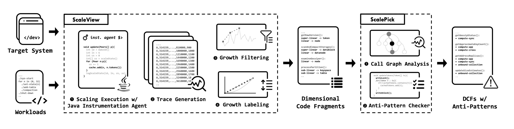

# ScaleLens



This documentation describes how to run a scaling experiment. A scaling experiment is to scale up the system on some dimensions and measure the performance of the system by ScaleLens.

Throughout this documentation, we use the example of running scaling experiments on Cassandra 4.0.0.

## Prerequisites

To run a scaling experiment with ScaleLens, you need to have the following prerequisites.

### System

The [system](systems/) is the target system that you want to run the scaling experiment on. For system, you need to have 

1. source code (usually `.tar.gz` from GitHub release)  
2. build script (usually `build.sh`) that tailors the system to build system to `.jar` packages, and performs basic static analysis to generate a list of loops.

For example, for Cassandra 4.0.0, its system is available at [Cassandra 4.0.0](systems/CA/4.0.0/). The usage of `build.sh` is like:
    
``` sh
[build.sh] USAGE: build.sh <source_tarfile> <system-version>
[build.sh] <source_tarfile>: The system source tar.gz file.
[build.sh] <system-version>: The system version string (e.g. CA-4.0.0).
```

### Workloads

The [workloads](workloads/) are the operations that you want to run on the system in a scaling manner. The most significant feature of workloads is that they will start the system with ScaleLearning agent attached. Workloads can be diverse, but in general they includes

1. scripts that setup and start the system with ScaleLearning agent attached.
2. scripts that run the operations to scale the system up via the system's API.
3. some supplementary files that are used by the scripts.

For example, for Cassandra 4.0.0, its workloads are available at [Cassandra 4.0.0](workloads/CA/4.0.0/). `setup-node.sh` and `start-node.sh` are the scripts that setup and start the system with ScaleLearning agent attached. Shell scripts with `w-` prefix are the scripts that run the operations to scale the system up via the system's API.


### Experiment Configuration

The [experiment configuration](experiments/) is a YAML file that specifies the configurations of the scaling experiment. It has two parts: `experiment` and `workloads`. 

1. `experiment` part specifies the configurations of the scaling experiment, such as the system, the scale, the batch size, the sleeping time, etc.
2. `workloads` part specifies a list of workloads to run, including the workload name, file name, number of dimensions, a switch to enable/disable the workload, etc.

For example, for Cassandra 4.0.0, its experiment configuration is available at [Cassandra 4.0.0](experiments/CA-4.0.0.yaml).


## Running a Scaling Experiment

In a nutshell, assuming all prerequisites are met, use the following steps to run a scaling experiment.

``` sh
bash run.sh [--analysis-only] <config_file> <working_space>
```

The usage of `run.sh` is like:

``` sh
[run.sh] USAGE: run.sh [--analysis-only] <config_file> <working_space>
[run.sh] --analysis-only: Run analysis only, skipping workload execution.
[run.sh] <config_file>: The configuration file (YAML) for the experiment.
[run.sh] <working_space>: The working directory for the experiment.
```

There is no need to create the working space directory, `run.sh` will create it if it does not exist. Once the working space directory is created, `run.sh` will process the following steps

1. Read the experiment configuration to know which system, workloads, and experiment configurations to execute.
2. Build the system and generate the list of loops via the build script (e.g. [build script](systems/CA/4.0.0/build.sh) for Cassandra 4.0.0).
3. Copy the system `.jar` packages, workloads to the working space.
4. Run workloads by invoking [workload executer](run_workloads.py).
5. Once the workloads are done, perform event parsing and event filtering by invoking [analyzer](run_trace_analysis.py).

After the experiment is done, the results are available as `.json` files at the working space directory. The results tell the loops that are correlated with the scale dimensions.

For example, to run a scaling experiment on Cassandra 4.0.0, just use the following command:

``` sh
bash run.sh ./experiments/CA-4.0.0.yaml workdir
```

